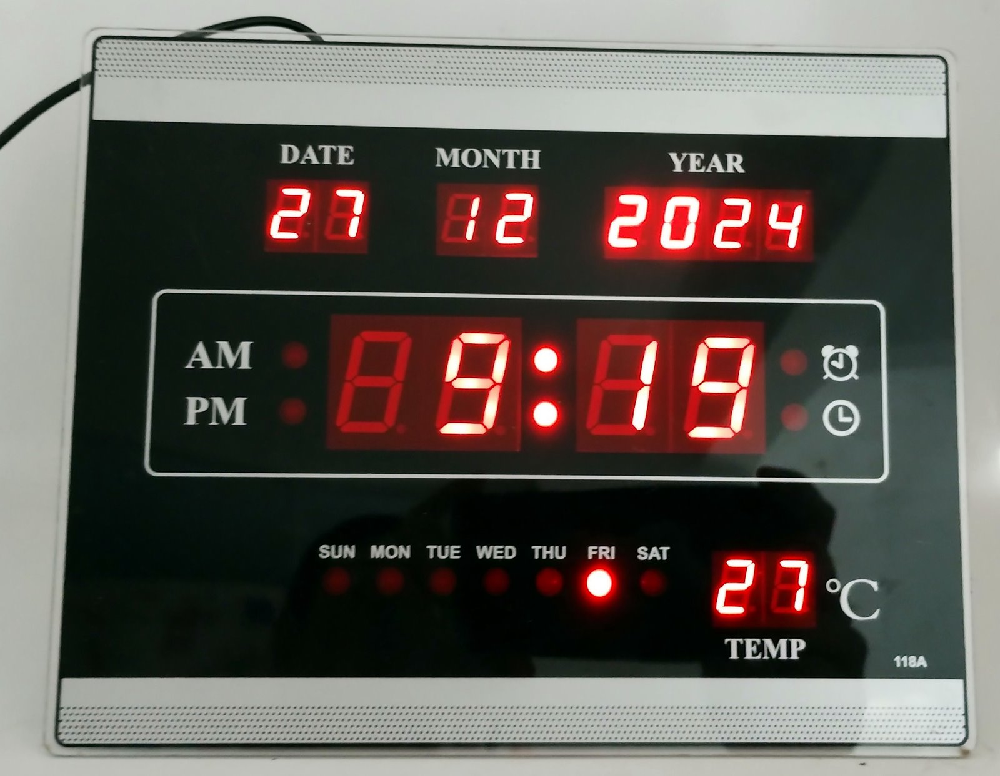
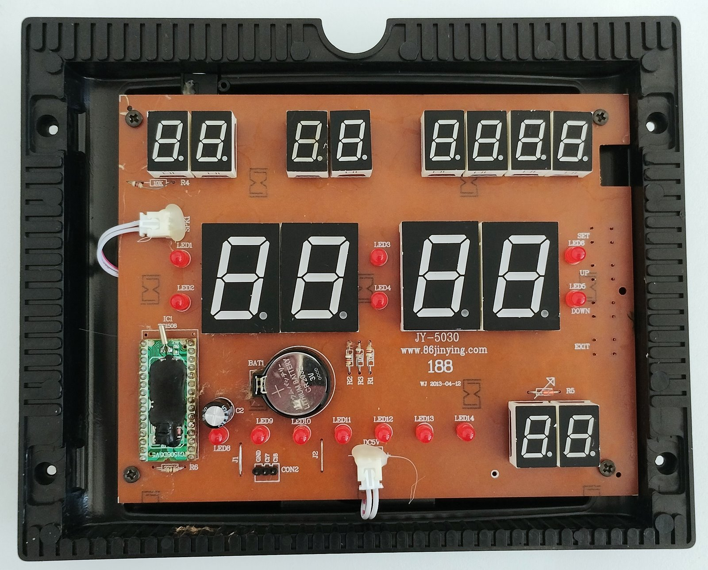
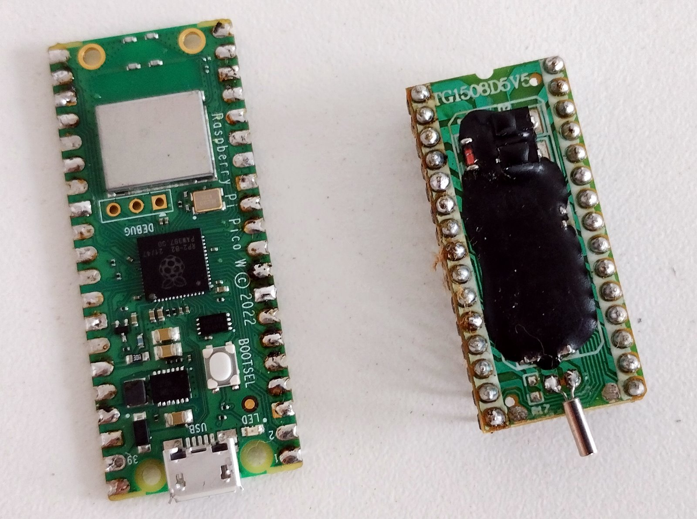
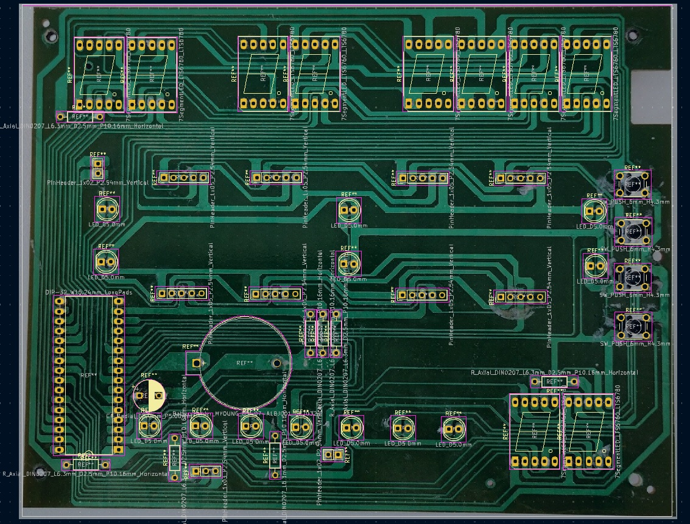
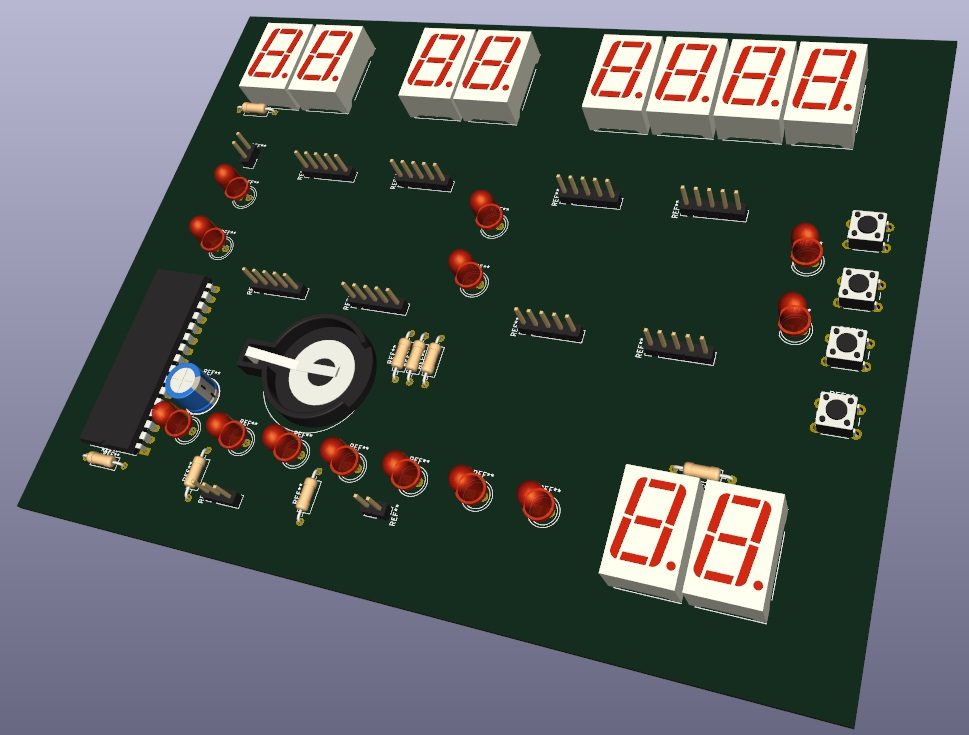
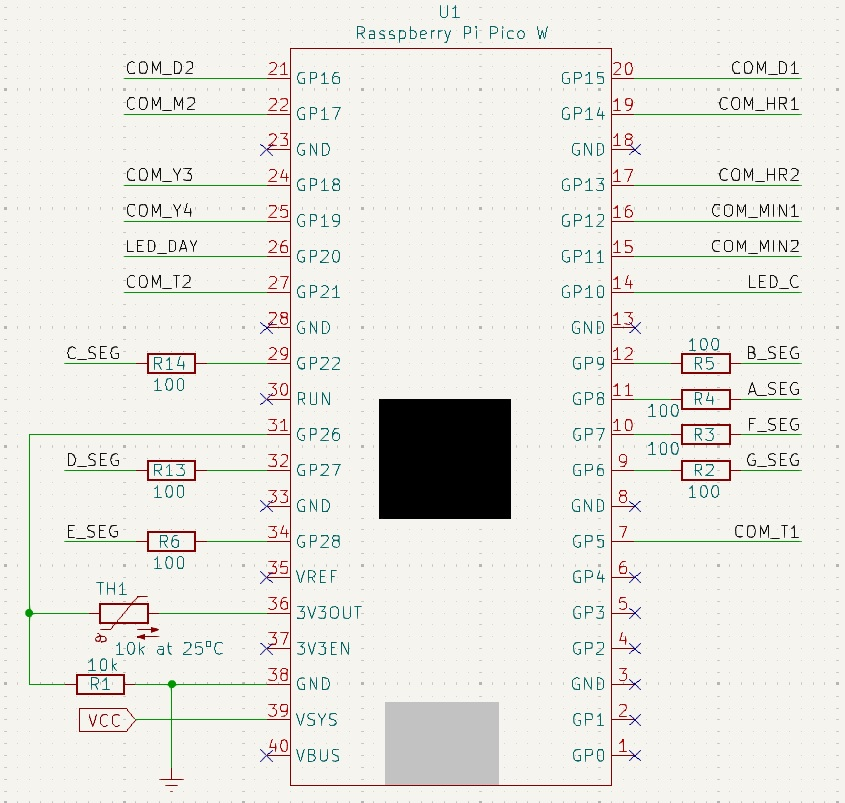
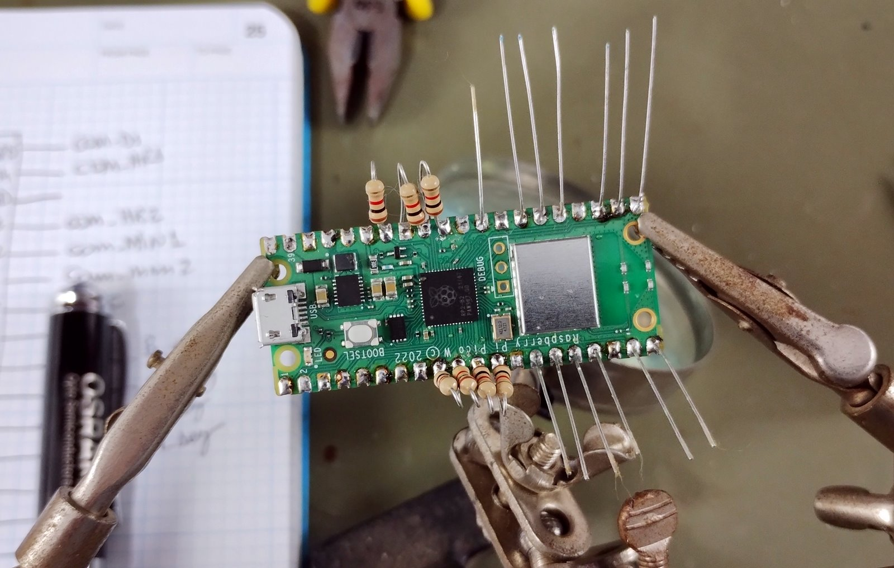
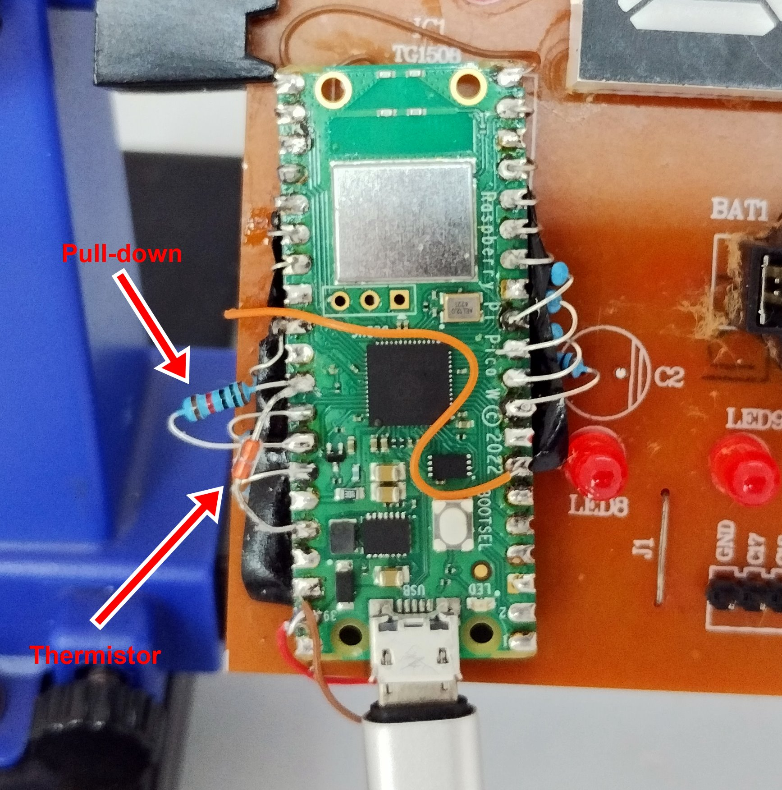
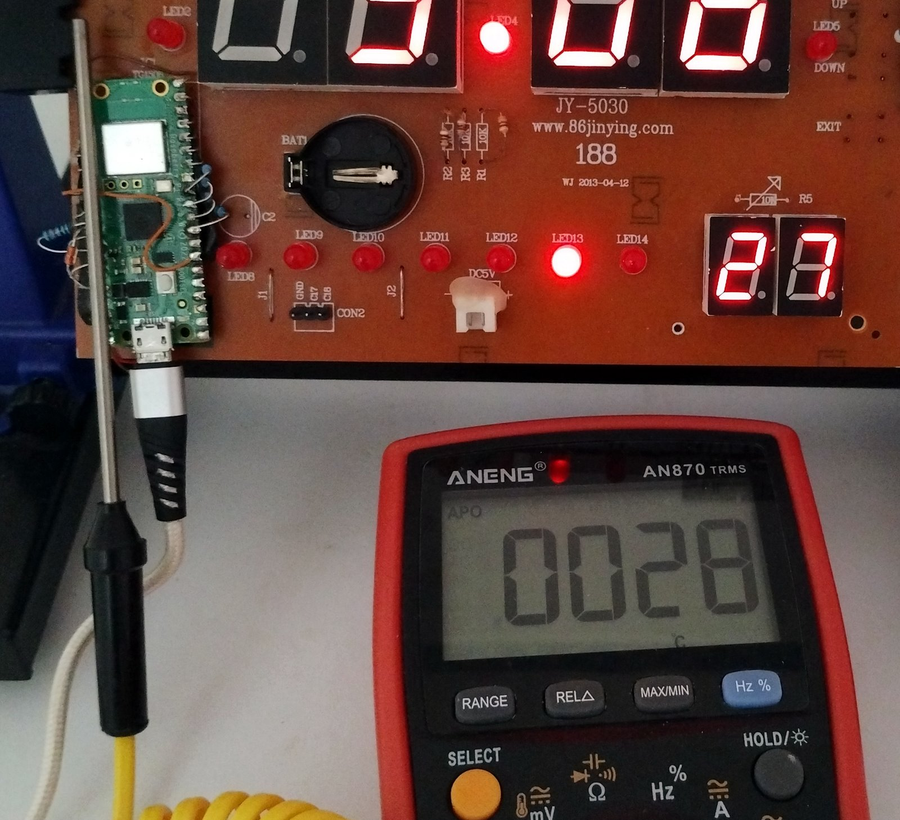

# Retrofit of a Electronic Clock/Calendar with Raspberry Pi Pico W

This project consists of retrofitting an electronic clock/calendar by replacing the original controller with a Raspberry Pi Pico W. The clock is updated via Wi-Fi using an NTP (Network Time Protocol) server.

### Context

I bought this digital clock/calendar from a recycling center for around $1, but it wasn't working. After examining it, I decided to replace the original controller (TG1508D5V5) with a Raspberry Pi Pico W. The goal was to turn it into an NTP clock, bringing new life to the device while adding modern functionality.

### Features
- **Automatic Time and Date Update**: The clock automatically synchronizes with NTP servers via Wi-Fi.
- **Custom Firmware**: New firmware specifically developed for the Raspberry Pi Pico W.
- **Complete Electronic Schematic**: The project includes the electronic schematic documented in KiCad, created through reverse engineering of the original clock PCB design.

## Video Demonstration

I’ve created this video to showcase how the project works and the reverse engineering process behind it:

### Hardware

I tested the original digital clock/calendar and it was not working. Upon troubleshooting, I traced the defect to the TG1508 controller, which was likely damaged. Since it was difficult to find a replacement, I decided to substitute it with a Raspberry Pi Pico W, making the least amount of modifications to the original board.

The PCB:

The choice of the Raspberry Pi Pico W was driven by its size, which almost matches that of the original TG1508 controller. Additionally, the built-in Wi-Fi capability allows the clock to be updated via an NTP server.

*TG1508 and Raspberry Pi Pico W side by side*

To perform the modification, I had to reverse engineer the clock's PCB to create the electronic schematic. I started by taking a photo of the solder side of the clock's PCB and imported it into KiCad. Then, I mirrored the image to match the actual layout. I placed one of the components and adjusted the image dimensions to get the correct scale. With the correct dimensions, I proceeded to place the remaining components.

*Clock PCB in KiCad with all components placed*

With the components positioned, it became easier to trace the connections on the board. By using the image as a reference and testing the actual PCB with a multimeter set to continuity mode, I was able to map out all the connections accurately.

The resulting KiCad project from this reverse engineering process is available in the `hardware` folder of this repository. It contains the traced electrical schematic and the new connections for the Raspberry Pi Pico W.

*Clock PCB 3D*

The following image shows the electrical schematic for the connections to the Raspberry Pi Pico W. Seven current-limiting resistors were added for the LED display segments. Initially, I used 1k ohm resistors, but the LED brightness was too low. After initial testing, I replaced them with 100 ohm resistors.

*Raspberry Pi W schematic*

Regarding the temperature sensor, it was originally multiplexed with the common pins of the two displays used for temperature measurement. This configuration caused the temperature display to flicker in the firmware I developed. Therefore, I chose to remove the sensor from the board and solder it directly to the pins of the Raspberry Pi Pico W with a 10k pull-down resistor.

*Raspberry Pi Pico W with 1k ohm resistors during soldering*

*Final assembly of the Raspberry Pi Pico W*

I removed the battery holder as it was no longer necessary, and the 470uF capacitor to create more space for the Raspberry Pi Pico W assembly.

### Firmware

The firmware was developed using PlatformIO in Visual Studio Code with the Arduino framework. You can find the specific framework for the Raspberry Pi Pico W on [GitHub](https://github.com/maxgerhardt/platform-raspberrypi.git).

The firmware utilizes both cores of the Raspberry Pi Pico W. Core 0 is dedicated to Wi-Fi connectivity, accessing the NTP server, and updating the internal RTC clock of the Raspberry Pi Pico W.

Core 1 is responsible for controlling the displays and LEDs on the original clock board, which includes 12 seven-segment displays (day, month, year, hour, minute, and temperature), seven LEDs for the days of the week (Sunday to Saturday), and six additional LEDs.

The firmware attempts to connect to the Wi-Fi network until a connection is established and periodically checks the connection status. If the connection is lost, it attempts to reconnect. For NTP servers, I used two addresses; if one fails, the firmware tries the other. The NTP information is synchronized every 1 minute with the internal RTC of the Raspberry Pi Pico W.

The control of the LED displays is done by multiplexing the common pins of each display. Each display or LED is lit for only 1ms to ensure persistence.

For temperature measurement, the original circuit did not work, so I connected the thermistor directly to an ADC pin of the Raspberry Pi Pico W with a 10k ohm pull-down resistor. The reading is taken from this ADC pin using a function that employs the Steinhart-Hart equation. The result was compared with a reading from a multimeter with a thermocouple. A calibration constant was applied to refine the measurements, and the results were satisfactory.

*Temperature reading on the board and multimeter*

The firmware does not include code to handle the buttons or any functionality related to the alarm. Since the time adjustment is done via NTP, the buttons are not used, and I did not need the alarm functionality.

### Contact
Feel free to reach out to me on social media: @pakequis in any of them...

You can also send me an email at pakequis (Gmail).

